# 🛒 E-Commerce App

A modern, production-grade **E-Commerce Mobile Application** built with **Flutter** using **Clean Architecture** and the **BLoC (Cubit)** pattern. The app delivers a complete shopping experience with real-time OTP email authentication via **Supabase**, robust JWT token management, user-scoped local persistence with **Hive**, product browsing with animated category tabs, and online checkout powered by the **Paymob** payment gateway.

---

[](https://flutter.dev)
[](https://dart.dev)
[](https://blog.cleancoder.com/uncle-bob/2012/08/13/the-clean-architecture.html)
[](https://bloclibrary.dev)
[](https://pub.dev/packages/hive)
[](https://paymob.com)
[](LICENSE)

---

## 📑 Table of Contents

- [Overview](#-overview)
- [App Showcase](#-app-showcase)
- [Key Features](#-key-features)
- [Architecture & Design](#-architecture--design)
- [Project Directory Structure](#-project-directory-structure)
- [Tech Stack & Dependencies](#-tech-stack--dependencies)
- [Getting Started](#-getting-started)
  - [Prerequisites](#prerequisites)
  - [Installation](#installation)
  - [Code Generation](#code-generation)
- [Configuration & Environment](#-configuration--environment)
- [API & Services Overview](#-api--services-overview)
- [Author & Acknowledgments](#-author--acknowledgments)

---

## 🌟 Overview

This project showcases how to engineer an enterprise-level Flutter application that remains **scalable**, **testable**, and **maintainable**. By decoupling UI from business rules and data sources through **Clean Architecture**, each feature operates independently.

### Highlights
- **Multi-Tenant / Per-User Local Persistence**: Cart and Favorite items are stored in user-isolated Hive boxes (`favorites_box_<userId>` & `cart_box_<userId>`), preventing data overlap across different user sessions on the same device.
- **End-to-End Authentication**: Full authentication cycle with Platzi Fake Store API, Supabase OTP verification for registration and password recovery, and automatic JWT access/refresh token persistence.
- **Payment Processing**: Integrated Paymob gateway supporting Credit/Debit cards (Visa/Mastercard) and Mobile Wallets (Vodafone Cash, Orange Money, etc.).
- **Polished UI/UX**: Shimmer loading skeletons, animated category tabs, custom SVG graphics, responsive sizing across screen densities, and animated transitions.

---

## 📱 App Showcase

<div align="center">

### 🚀 Onboarding & Welcome
| Splash Screen | Onboarding 1 | Onboarding 2 | Welcome Page |
| :---: | :---: | :---: | :---: |
|  |  | 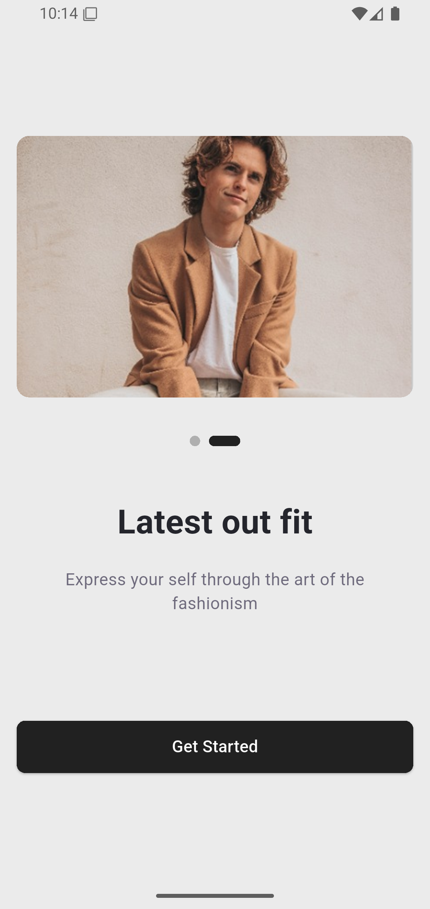 | 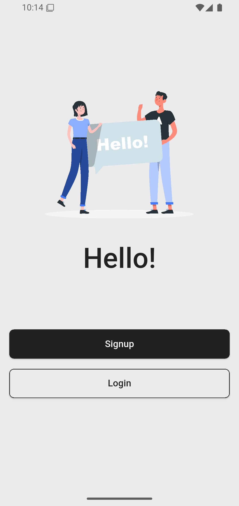 |

### 🔐 Authentication & Password Recovery
| Sign Up | Login | Forgot Password |
| :---: | :---: | :---: |
| 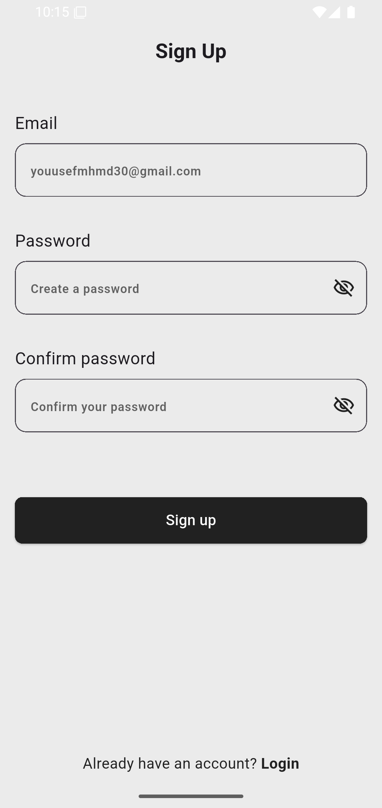 | 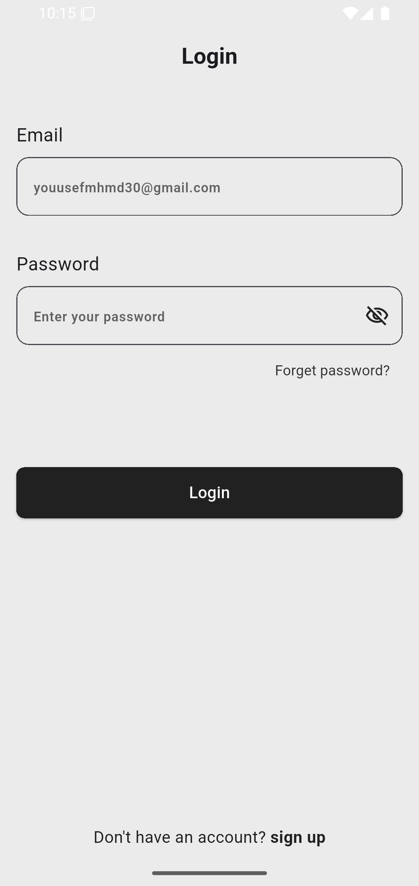 |  |

| OTP Verification | Reset Password | Password Reset Success |
| :---: | :---: | :---: |
| 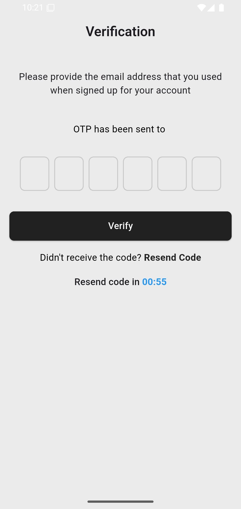 | 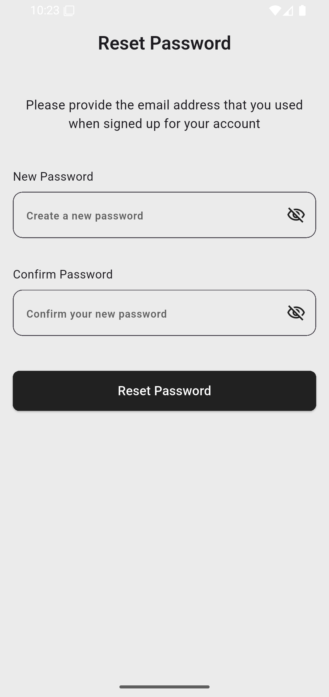 | 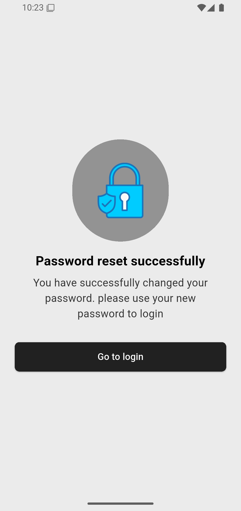 |

### 🛍️ Store Experience, Cart & Profile
| Home / Catalog | Product Details | Cart & Checkout |
| :---: | :---: | :---: |
| 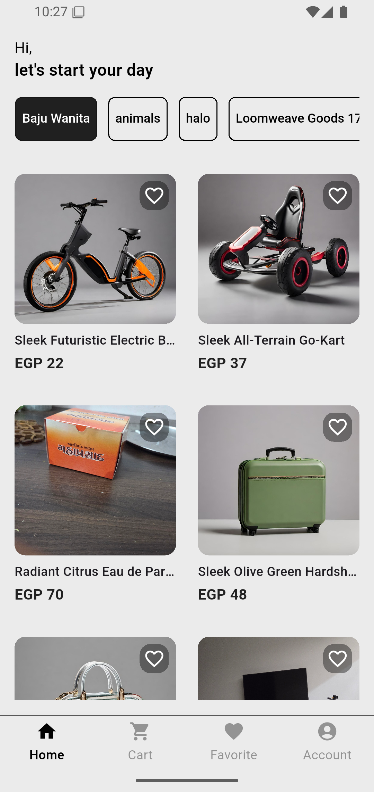 | 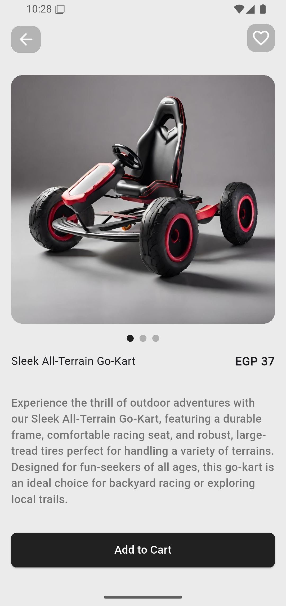 | 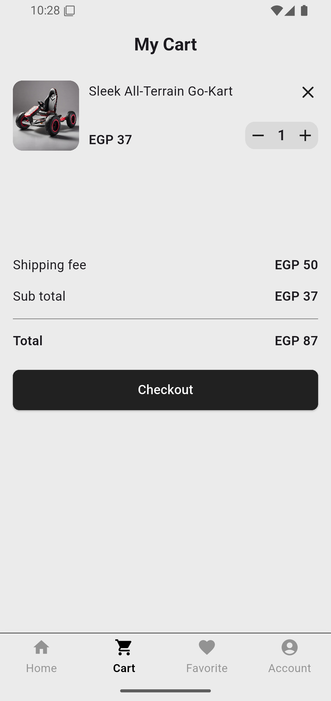 |

| Wishlist / Favorites | User Profile & Edit |
| :---: | :---: |
| 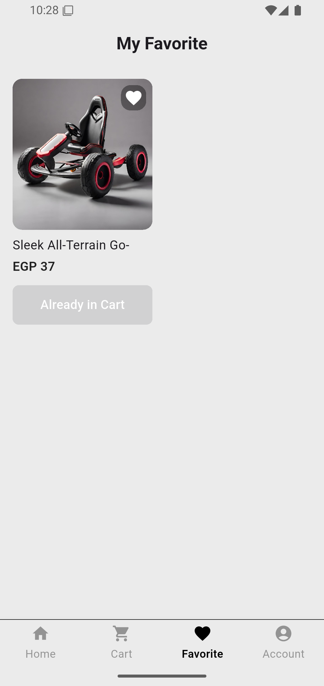 | 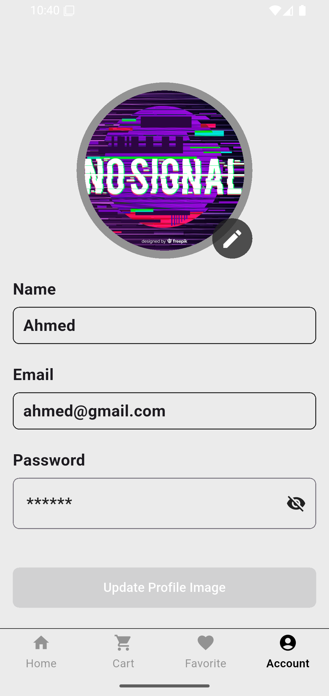 |

</div>

---

## ✨ Key Features

### 🔐 Authentication & Security
- **Registration with Email OTP**: Sends a one-time verification code via Supabase Auth before creating the account on the REST API.
- **Login & JWT Lifecycle**: Decodes and stores JWT `access_token` and `refresh_token` in encrypted hardware-backed storage (`flutter_secure_storage`).
- **Token Refresh**: Automatic token renewal mechanisms utilizing `jwt_decoder`.
- **Forgot & Reset Password**: Seamless OTP verification and password update flow with resend timer widgets.
- **Persistent Session**: Auto-login on app launch if a valid authentication token exists.

### 🛍️ Product Catalog & Discovery
- **Category Tabs**: Animated horizontal category filtering using `buttons_tabbar` with shimmer loading states.
- **Product Grid**: Responsive product cards displaying product image, title, price, category, and quick add-to-cart/favorite actions.
- **Smart Data Filtering**: Filters out invalid placeholder images dynamically.
- **Product Details**: Full details view with product image previews, descriptions, pricing, and purchase controls.

### 🛒 Cart & Multi-User Offline Storage
- **Isolated Hive Storage**: Cart data is cached in per-user Hive boxes.
- **Item Controls**: Add to cart, adjust item counts (increment/decrement), and delete items.
- **Live Price Breakdown**: Real-time computation of subtotal, configurable shipping fee, and grand total.
- **Auto-Clear**: Automatically empties cart state and persistent box upon successful checkout.

### ❤️ Favorites & Wishlist
- **Toggle Wishlist**: Add and remove items with real-time UI state synchronization.
- **Direct Cart Transfer**: Move favorite items directly into the shopping cart with a single click.
- **Empty State Illustrations**: Informative vector illustrations when the wishlist or cart is empty.

### 💳 Paymob Payment Gateway
- **Card Payments**: In-app payment screen for Visa & Mastercard transactions.
- **Mobile Wallets**: Supports regional e-wallets (Vodafone Cash, Orange, Etisalat, etc.).
- **Transaction Feedback**: Success callback with route cleanup and order placement confirmation.

### 👤 Profile & Account Management
- **Profile View**: Display account details (name, email, role, avatar).
- **Profile Picture Upload**: Pick images from device storage/gallery (`image_picker`) and upload via multipart file endpoint.
- **Secure Logout**: Clears authentication credentials, wipes active user session, and redirects to login/onboarding.

---

## 🏛️ Architecture & Design

The application adheres strictly to **Clean Architecture** principles structured by feature. Each feature is split into three decoupled layers:

```
┌─────────────────────────────────────────────────────────┐
│                   Presentation Layer                    │
│   (Pages, Widgets, BLoC / Cubits, ViewModels, States)    │
└───────────────────────────┬─────────────────────────────┘
                            │ depends on
┌───────────────────────────▼─────────────────────────────┐
│                      Domain Layer                       │
│    (Entities, Use Cases, Repository & Source Contracts)  │
└───────────────────────────▲─────────────────────────────┘
                            │ implemented by
┌───────────────────────────┴─────────────────────────────┐
│                       Data Layer                        │
│   (DTOs / Models, Repository Impls, APIs, Data Sources)  │
└─────────────────────────────────────────────────────────┘
```

### Dependency Flow (Mermaid Diagram)

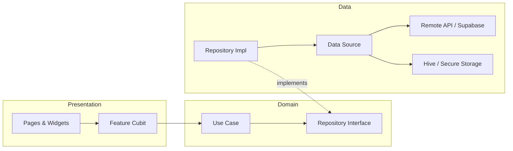

### Layer Responsibilities
1. **Presentation**: Responsible solely for UI rendering and capturing user inputs. State management is handled with **Cubit** (`flutter_bloc`), consuming domain use cases via constructor injection.
2. **Domain**: The core business logic layer. Completely independent of external packages, Flutter UI widgets, and network clients. Defines **Entities**, **Use Cases**, and **Repository Interfaces**.
3. **Data**: Implements domain contracts. Handles raw API communication (`http`), JSON mapping (DTOs), local storage caching (`hive`), and encrypted storage (`flutter_secure_storage`).
4. **Core**: Contains cross-cutting concerns: dependency injection (`get_it`), routing (`AppRoutes`), theme colors (`AppColors`), constants (`AppConstants`), global dialogs, toast notifications, and shared widgets.

---

## 📁 Project Directory Structure

```text
lib/
├── core/
│   ├── model/                  # Core models (e.g. OnboardingModel)
│   ├── utils/                  # Constants, AppApi, Routes, Colors, Assets, Storage helpers
│   │   ├── app_api.dart        # API endpoints & base URLs
│   │   ├── app_assets.dart     # Asset string references
│   │   ├── app_colors.dart     # Application color palette
│   │   ├── app_constants.dart # App keys, Paymob configs, Supabase URLs
│   │   ├── app_dialogs.dart    # Dialog & SnackBar helpers
│   │   ├── app_routes.dart     # Centralized route name constants
│   │   ├── app_toast.dart      # Toast notification wrapper
│   │   ├── get_it.dart         # Service Locator (Dependency Injection setup)
│   │   ├── secure_storage.dart # Encrypted JWT storage helper
│   │   ├── shared_preferences.dart # SharedPreferences helper
│   │   └── user_hive_boxes.dart# User-scoped Hive box resolver
│   └── views/
│       ├── pages/              # Splash, Onboarding, Hello pages
│       └── widgets/            # Custom reusable buttons, inputs, navigation bars
├── features/
│   ├── account/                # Profile management & avatar upload
│   │   ├── data/               # AccountApi, DTOs, DataSource & Repo Impl
│   │   ├── domain/             # Entities, Repository contracts, UseCases
│   │   └── presentation/       # AccountPage, AccountCubit & States
│   ├── auth/                   # Registration, Login, OTP Verification, Password Reset
│   │   ├── data/               # AuthApi, Auth DTOs, DataSource & Repo Impl
│   │   ├── domain/             # Auth Entities, Repository contracts, UseCases
│   │   └── presentation/       # Login, Register, OTP & Reset Password Views, AuthCubit
│   ├── cart/                   # Shopping cart & Paymob payment
│   │   ├── data/               # CartApi, Cart DataSource & Repo Impl
│   │   ├── domain/             # Cart Repository contracts, UseCases
│   │   └── presentation/       # CartPage, CartWidget, CartCubit & States
│   ├── favorite/               # Wishlist / Bookmarks
│   │   ├── data/               # FavoriteApi, Favorite DataSource & Repo Impl
│   │   ├── domain/             # Favorite Repository contracts, UseCases
│   │   └── presentation/       # FavoritePage, FavoriteItemWidget, FavoriteCubit
│   └── home/                   # Catalog, Categories, Product Listing & Details
│       ├── data/               # HomeApi, Product/Category DTOs & Models, TypeAdapters
│       ├── domain/             # Product & Category Entities, UseCases
│       └── presentation/       # HomePage, ProductDetailsPage, HomeCubit
└── main.dart                   # Application entrypoint & initialization
```

---

## 🛠️ Tech Stack & Dependencies

| Category | Technology / Library | Purpose |
| :--- | :--- | :--- |
| **Framework** | [Flutter](https://flutter.dev) (Dart 3.x) | Cross-platform mobile development |
| **State Management** | [`flutter_bloc`](https://pub.dev/packages/flutter_bloc) | Predictable state management via Cubit |
| **Dependency Injection** | [`get_it`](https://pub.dev/packages/get_it) | Service locator for inversion of control |
| **Networking** | [`http`](https://pub.dev/packages/http) | RESTful API requests & multipart uploads |
| **Auth & Cloud Services** | [`supabase_flutter`](https://pub.dev/packages/supabase_flutter) | Email OTP verification & authentication backend |
| **Local Database** | [`hive`](https://pub.dev/packages/hive) & [`hive_flutter`](https://pub.dev/packages/hive_flutter) | Fast, lightweight NoSQL offline database |
| **Secure Storage** | [`flutter_secure_storage`](https://pub.dev/packages/flutter_secure_storage) | Keychain / KeyStore encrypted token storage |
| **Payment Gateway** | [`pay_with_paymob`](https://pub.dev/packages/pay_with_paymob) | Seamless Paymob card & mobile wallet integration |
| **Responsive Design** | [`flutter_screenutil`](https://pub.dev/packages/flutter_screenutil) | Dynamic sizing, font scaling & layout adaptation |
| **Image Caching & UX** | [`cached_network_image`](https://pub.dev/packages/cached_network_image) & [`shimmer`](https://pub.dev/packages/shimmer) | Smooth remote image loading with shimmer skeleton |
| **UI Components** | [`animated_bottom_navigation_bar`](https://pub.dev/packages/animated_bottom_navigation_bar) | Animated curved bottom navigation bar |
| **Tabs & Pagination** | [`buttons_tabbar`](https://pub.dev/packages/buttons_tabbar) & [`smooth_page_indicator`](https://pub.dev/packages/smooth_page_indicator) | Custom category tabs & onboarding indicator |
| **Inputs & Alerts** | [`pin_code_fields`](https://pub.dev/packages/pin_code_fields) & [`toastification`](https://pub.dev/packages/toastification) | OTP pin input fields & modern toast notifications |
| **Code Generation** | [`build_runner`](https://pub.dev/packages/build_runner) & [`hive_generator`](https://pub.dev/packages/hive_generator) | Generates Hive TypeAdapters (`ProductModelAdapter`, `CartItemModelAdapter`) |

---

## 🚀 Getting Started

### Prerequisites
Before running the application, make sure you have the following installed:
- [Flutter SDK](https://docs.flutter.dev/get-started/install) (`^3.9.2` or later)
- [Dart SDK](https://dart.dev/get-dart)
- Android Studio / VS Code with Flutter extensions
- Android Emulator or physical device / iOS Simulator

### Installation

1. **Clone the repository:**
   ```bash
   git clone https://github.com/Ahmed-Moataz-glitch/E-Commerce.git
   cd E-Commerce
   ```

2. **Install project dependencies:**
   ```bash
   flutter pub get
   ```

3. **Generate code (Hive TypeAdapters):**
   ```bash
   dart run build_runner build --delete-conflicting-outputs
   ```

4. **Launch the application:**
   ```bash
   flutter run
   ```

---

## ⚙️ Configuration & Environment

Configuration keys are centralized under `lib/core/utils/app_constants.dart`:

```dart
abstract class AppConstants {
  static const String appName = 'E-Commerce';
  static const String accessTokenKey = 'access-token';
  static const String refreshTokenKey = 'refresh-token';
  
  // Paymob Payment Integration Keys
  static const String paymobApiKey = '<YOUR_PAYMOB_API_KEY>';
  static const String iframeId = '<YOUR_IFRAME_ID>';
  static const String integrationCardId = '<YOUR_CARD_INTEGRATION_ID>';
  static const String integrationMobileWalletId = '<YOUR_WALLET_INTEGRATION_ID>';
  
  // Supabase Configuration
  static const String supabaseUrl = '<YOUR_SUPABASE_PROJECT_URL>';
  static const String publishableKey = '<YOUR_SUPABASE_ANON_KEY>';
  
  // Hive Boxes & Fees
  static const String favoritesBox = 'favorites_box';
  static const String cartBox = 'cart_box';
  static const String shippingFee = '50';
}
```

> [!TIP]
> For production deployments, consider loading sensitive API keys and secrets securely via `--dart-define` or `.env` configuration files.

---

## 🔌 API & Services Overview

### 1. Platzi Fake Store REST API
The app communicates with the Platzi Fake Store API (`api.escuelajs.co`):
- `POST /api/v1/users`: Create new user profile.
- `POST /api/v1/auth/login`: Authenticate credentials and receive JWT access/refresh tokens.
- `POST /api/v1/auth/refresh-token`: Renew expired access tokens.
- `GET  /api/v1/auth/profile`: Fetch current authenticated user info.
- `PUT  /api/v1/users/{id}`: Update user credentials / password.
- `GET  /api/v1/categories`: Retrieve all product categories.
- `GET  /api/v1/products`: Retrieve catalog products.
- `POST /api/v1/files/upload`: Upload profile pictures.

### 2. Supabase Auth (OTP Verification)
- Used to send 6-digit OTP codes directly to user emails during registration and password reset workflows.
- Verifies the OTP on-device to confirm email ownership before granting password reset or registration completion.

### 3. Paymob Payment Gateway
- Initializes payment transaction parameters (`apiKey`, `iframeId`, `integrationCardId`, `integrationMobileWalletId`).
- Calculates dynamic cart totals (Subtotal + Shipping Fee).
- Renders an interactive payment view supporting Card and Mobile Wallet payment methods.

---

## 🤝 Contributing

Contributions are welcome! If you would like to enhance the app:

1. Fork the Project
2. Create your Feature Branch (`git checkout -b feature/AmazingFeature`)
3. Commit your Changes (`git commit -m 'feat: add AmazingFeature'`)
4. Push to the Branch (`git push origin feature/AmazingFeature`)
5. Open a Pull Request

---

## 👨‍💻 Author

**Ahmed Moataz**
- GitHub: [@Ahmed-Moataz-glitch](https://github.com/Ahmed-Moataz-glitch)
- Project Repository: [Ahmed-Moataz-glitch/E-Commerce](https://github.com/Ahmed-Moataz-glitch/E-Commerce)

---

<div align="center">
  <sub>Built with ❤️ using Flutter & Clean Architecture</sub>
</div>
